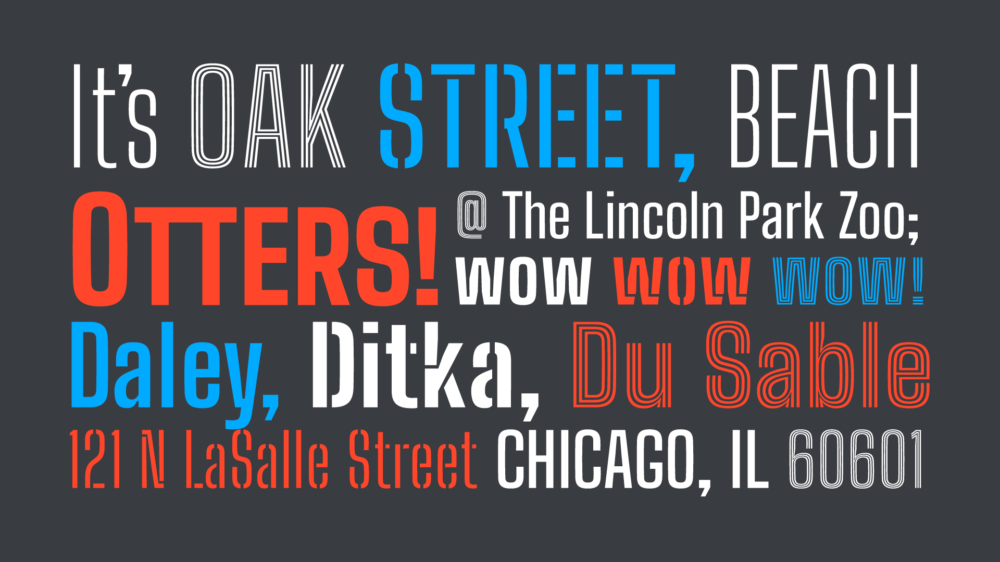

# Big Shoulders

Big Shoulders is a superfamily of condensed American Gothic variable fonts, created for the Chicago Design System, as well as the citizens of Chicago. The family&apos;s tall, sans-serif forms are based in Chicago&apos;s multiple histories in railway transport, public political action, and dance.



The entire family is hosted on Google Fonts.

<br>

## Build Instructions

The Big Shoulders superfamily is composed by Big Shoulders, Big Shoulders Display, and Big Shoulders Inline.

The families are built using fontmake and gftools post processing script. Tools are all python based.

To install all the Python tools, first create a virtualenv. This step should be done only once:

```

# create a virtual environment
    python3 -m venv venv

# activate the venv
    source venv/bin/activate

# install the required dependencies
    pip install -r requirements.txt

```

Once the virtual environment is activated, run the build script that is on each subfamily folder in the terminal, e.g.:

```
cd Big-Shoulders
cd sources
sh build-B.sh
```
<br>

## Change log

updated as of 08/27/2020

Big Shoulders VF Text and Display version 2.002
Stat table fix for publishing into Google Fonts

Big Shoulders Inline VF Text and Display version 2.002
Stat table fix for publishing into Google Fonts

Big Shoulders Stencil VF Text and Display version 2.001
Stat table fix for publishing into Google Fonts

updated as of 04/17/2020

added Big Shoulders Stencil version 1.0

added Big Shoulders Inline version 1.0

Updated Big Shoulders to version 1.1

note that v1.0 of Big Shoulders Stencil & Inline contain the same changes introduced in Big Shoulders v1.1

corrected Polish diacritics (many thanks to Cathy Kwiatkowski)

removed case-sensitive combining marks

corrected positioning of all combining marks

corrected lowercase d, l and t with caron

added tf ligature

added rectangle for Chicago Design System logotypes, can be invoked with discretionary ligatures turned on and typing CHIRECT

added six pointed star glyph as an alternate method of invoking the Chicago star

added filled rectangle glyph to invoke Chicago rectangle

updated bar glyph to better work in context of Chicago departmental acronyms

updated as of 08/14/2019

changed keyboard combo to get a Chicago star. now you type CHISTAR (making sure discretionary ligatures are turned on). your application should automatically replace it with a six-pointed star.

updated as of 08/07/2019

added Optical Size axis, so the family is now 16 fonts: Big Shoulders Text (in 8 weights) and Big Shoulders Display (in 8 weights).

the Variable Font family name is Big Shoulders; styles appear in a style submenu with text and Display interleaved.

the OTF and TTF family names are split into Big Shoulders Text and Big Shoulders Display; you’ll see both with an 8-weight submenu, from Thin to Black.

use Big Shoulders Text for sizes up to 72 point. use Big Shoulders Display for anything larger.

updated as of 06/11/2019

added instructions for CSS

fixed several interpolations as a part of my final detailing. this pertains mostly to shapes with extreme counters and complex inner strokes: A, M, N, V, W X, Y, a, e. g, v, w, x, y.

added a new tt ligature.

refined the lowercase g's lower bowl and ear.

updated as of 06/11/2019

moved previous R to an alternate, added new R with diagonal leg.

updated as of 06/10/2019

added case-sensitive diacritics—this means uppercase and small caps forms have vertically shorter diacritics so that you can stack lines of uppercase tighter and keep an even line

added a full set of small caps, including all diacritics & punctuation

added .sinf and .sups (scientific inferiors and superscript)

tweaked angled accents (grave, acute, double grave, Hungarian umlaut, circumflex, ) to be steeper and shorter so that lowercase characters can pack tighter together.


updated as of 05/27/2019

first pass at spacing and kerning completed

Chicago 6-point star added as a discretionary ligature. in desktop apps, turn on D ligs in the opentype panel and type **** which will then transform to a Chi star.

in CSS, turn on .dlig and add text **** to your source.

all global currency symbols added.

fractions, superscript and subscript added.

full set of diacritics covering 80 languages.

